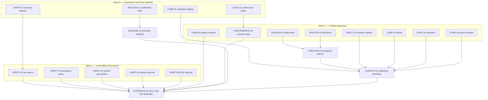

# Architecture Remediation Plan

- Area: Architecture, verification, documentation, and release readiness
- Status: archived; completed 2026-08-04
- Owner: Jarod
- Last updated: 2026-08-04

This plan addresses every finding from the 2026-08-04 architecture review. It is
organized as independently grabbable slices so several agents can work concurrently
without sharing implementation context or editing the same files.

The plan does not assume that every risk deserves a refactor. Each finding ends in one
of four outcomes:

1. **Fix** — observed behavior is incorrect or an accepted decision is violated.
2. **Deepen** — a shallow module or misplaced seam is replaced by a deeper module.
3. **Prove** — the intended architecture is sound, but its guarantee is not enforced.
4. **Decide and record** — evidence is insufficient for code change, so the owner
   accepts, rejects, or gives the finding a concrete trigger.

## Completion criteria

The remediation is complete only when:

- direct construction and registry construction agree on every built-in metadata
  default;
- Creator placement behavior and Creator workspace lifetime sit behind their intended
  headless seams;
- every Creator drawing site uses the closed primitive seam, including the assembled
  Creator and a host replacement adapter;
- unit, browser, and E2E test projects are mechanically distinct, and warnings,
  unexpected browser console errors, forbidden dependencies, real timers, and stale
  parity proofs fail a named check;
- the architecture checker, contract check, pack test, and E2E lifecycle prove the
  guarantees claimed by the ADRs;
- public package interfaces have an intentional-export ledger and no export survives
  solely because an internal test imports it;
- project status, glossary, release posture, and ADR status agree; and
- `pnpm run verify` passes without warnings or unexpected console output.

## Rules every agent follows

Before changing code, every agent reads:

1. `AGENTS.md`;
2. `docs/library-development-guidelines-details.md` in full;
3. this plan;
4. the ADRs listed on its slice; and
5. any nested `AGENTS.md` in its write zone.

Every implementation slice must:

- preserve `core ← react` and `core ← creator-core ← creator-react`;
- keep core packages DOM-free and runtime-dependency-free;
- preserve TypeScript 5.5 declaration compatibility;
- use the published package interface for cross-package, browser, E2E, and host tests;
- keep the JSON definition and metadata registry authoritative;
- add or replace tests at the changed module's interface;
- remove superseded tests of shallow implementation details rather than layering a
  second suite over them;
- keep tests parallel-safe and free of real timers, network, filesystem, and DOM in
  unit projects;
- update committed contracts and conformance cases when observable shape or behavior
  changes; and
- finish with no lint, compiler, test, browser-console, or tool deprecation warnings.

## Multi-agent execution model

### Branches and worktrees

Use one branch and worktree per slice when multiple agents run concurrently. Branches
use `codex/arch-<slice-id>-<slug>`. A slice produces one reviewable commit or pull
request and does not absorb adjacent cleanup.

If agents share one worktree, the coordinator may run only slices whose write zones do
not overlap. The filesystem is shared; a branch name alone does not prevent collisions.

### Integration-owned files

Workers do not edit these shared fan-in files unless their slice explicitly owns the
integration phase:

- `package.json` and `pnpm-lock.yaml`;
- root `tsconfig.json` and CI workflow files;
- package entry files such as `packages/*/src/index.ts` and `index.tsx`;
- `docs/NORTH_STAR.md`, `docs/delivery-roadmap.md`, and ADR indexes; and
- generated files in `contracts/`.

When a worker needs one of these changed, its handoff lists the exact delta. The
integration agent applies all fan-in edits once, after the contributing slices land.

### Slice handoff contract

Each agent hands back:

- outcome and architectural rationale using **module**, **interface**, **seam**,
  **adapter**, **depth**, **leverage**, and **locality**;
- files changed and files deliberately left unchanged;
- tests added, replaced, or removed;
- commands run and their results;
- contract, conformance, published-interface, or ADR impact;
- any required fan-in delta; and
- the next unblocked slice IDs.

### Interface design gates

`CREATOR-01`, `CREATOR-02`, `CORE-02`, and any public-interface change in
`SURFACE-01` begin with design-it-twice:

- three design agents work in parallel;
- one minimizes the interface to one to three entry points;
- one maximizes extension flexibility;
- one optimizes the common caller;
- the coordinator compares depth, locality, seam placement, error modes, ordering
  constraints, and TypeScript 5.5 compatibility; and
- implementation begins only after one design or a documented hybrid is selected.

Design agents do not edit code. This prevents several implementation agents from
inventing incompatible interfaces at the same seam.

## Dependency and concurrency map



The diagram expresses prerequisites, not a requirement to wait for an entire wave.
Any slice starts as soon as its incoming arrows are satisfied and its write zone is
free.

## Slice index

| Slice | Outcome | Dependency | Write zone | Size |
| --- | --- | --- | --- | --- |
| CORE-01 | Fix built-in default divergence | none | core metadata + one unit test | M |
| VERIFY-01 | Make the current verification output clean | none | named browser tests and image renderers | S |
| DOCS-01 | Establish glossary and truthful current status | none | `CONTEXT.md` + selected docs | M |
| RELEASE-01 | Record owner release decision or explicit deferral | none | decision record only | S |
| VERIFY-02 | Enforce distinct test seams | VERIFY-01 | test tsconfigs/config + unit tests | L |
| VERIFY-03 | Deepen workspace policy enforcement | none | `scripts/lib` + architecture checker | L |
| VERIFY-04 | Prove artifact guarantees | none | contract/pack scripts + tests | M |
| VERIFY-05 | Make parity evidence executable | none | new proof checker | M |
| VERIFY-06 | Collapse duplicate E2E lifecycle wiring | none | Playwright/root/CI handoff | S |
| CREATOR-01 | Move placement lifecycle headlessly | design gate | creator placement modules/tests | L |
| CREATOR-03 | Complete primitive seam | none | creator-react primitives/panels/tests | M |
| REACT-01 | Remove mutable default renderer risk | none | react renderer registry/tests | M |
| CORE-02 | Deepen survey timing | CORE-01, design gate | core timing modules/tests | M |
| CORE-03 | Concentrate expression operator knowledge | CORE-01 | core expressions/tests | M |
| CORE-04 | Establish dependency-graph performance facts | none | dependency benchmarks/tests | M |
| CORE-05 | Decide and, if justified, simplify parse interface | CORE-01 | serialization/tests | M |
| CONFORMANCE-01 | Record multi-runtime scope and scoring trigger | DOCS-01 | conformance docs/corpus decision | S |
| CREATOR-02 | Deepen Creator workspace lifetime | CREATOR-01, CREATOR-03, design gate | creator-core/creator-react/host | L |
| SURFACE-01 | Audit and narrow published interfaces | module slices complete | package entries + pack fixture | L |
| RELEASE-02 | Implement or deliberately withhold release activation | RELEASE-01 | release state and documentation | M/L |
| INTEGRATE-01 | Apply fan-in deltas and run final gates | all accepted slices | shared fan-in files | L |

## Implementation ledger

Updated 2026-08-04. A slice is complete only when its focused proof and required
repository checks pass; “in progress” means its write zone is currently assigned.

| State | Slices |
| --- | --- |
| Complete | CORE-01, CORE-02, CORE-03, CORE-04, CORE-05, CONFORMANCE-01, VERIFY-01, VERIFY-02, VERIFY-03, VERIFY-04, VERIFY-05, VERIFY-06, DOCS-01, CREATOR-01, CREATOR-02, CREATOR-03, REACT-01, SURFACE-01, RELEASE-01, INTEGRATE-01 |
| Closed by publication hold | RELEASE-02 |

## Wave 0 — correctness and clean baseline

### CORE-01 — Unify the built-in metadata catalog

**Outcome:** Fix and deepen.

**Why:** `PropertyDefaults.ts` and `registerBuiltInTypes.ts` carry different family
catalogs. Directly constructed matrix, panel, and media models therefore return values
that disagree with their descriptors.

**Primary files:**

- `packages/core/src/metadata/PropertyDefaults.ts`
- `packages/core/src/metadata/registerBuiltInTypes.ts`
- `packages/core/src/metadata/*TypeDefinitions.ts`
- `packages/core/test/unit/MetadataRegistry.test.ts`

**Constraints:**

- align with ADR-0016;
- do not attach a mutable registry to every model;
- do not write defaults into authored values at parse time; and
- keep factories separate from model-free metadata definitions.

**Proof:**

- replace the three-type sample with a table derived from the complete built-in
  metadata catalog;
- prove each directly constructed public model resolves every inherited and own
  default exactly as a registry-created instance does;
- prove an explicitly authored falsy/empty value still overrides the default; and
- keep round-trip and contract checks green.

**Commands:** targeted metadata tests, `test:unit`, `check:contract`, `lint`,
`typecheck`, and `check:arch`.

### VERIFY-01 — Remove existing warnings and browser console errors

**Outcome:** Fix.

**Primary files:**

- the six creator browser tests importing `@vitest/browser/context`;
- `packages/react/src/ImageElementRenderer.tsx`;
- any other renderer proven to emit an empty media `src`; and
- focused browser tests for absent media sources.

**Work:**

- migrate deprecated Vitest browser imports to the supported entry;
- prevent rendering media elements with an empty `src`, or omit the attribute when
  that is the observable requirement;
- identify whether all five console errors share one module or more than one; and
- add regression tests that would fail if the error returns.

**Proof:** `test:browser` produces zero deprecation warnings and zero unexpected
`console.error` messages before enforcement is added by `VERIFY-02`.

### DOCS-01 — Establish domain context and truthful project status

**Outcome:** Fix documentation locality.

**Primary files:**

- new root `CONTEXT.md`;
- `docs/NORTH_STAR.md`;
- `docs/delivery-roadmap.md`;
- `docs/library-development-guidelines-details.md`; and
- ADR index/status text where it is factually inconsistent.

**Work:**

- create a compact glossary for Survey, Definition, Registry, Question, Page,
  Response, Creator, Design Surface, Placement, Workspace, Session, Renderer,
  Primitive, Contract, Conformance Corpus, and Host;
- correct stale `npm pack`, `tsgo`, phase-status, and acceptance wording;
- distinguish “functional Phase 3 acceptance is proven” from “release exit is
  pending owner decisions,” if that is the current truth;
- record that the cross-language seam currently has one adapter; and
- link every summary topic to its authoritative ADR or deeper document.

**Proof:** a new agent can identify current phase, release blockers, package graph,
and domain terms from `CONTEXT.md` plus one linked document per topic.

### RELEASE-01 — Record owner release decision or explicit deferral

**Outcome:** Decide or deliberately defer and record. This slice requires Jarod's
direction; an agent may prepare evidence and draft ADR amendments but must not choose
for the owner.

**Questions:**

1. Has Phase 3 exited, or is functional acceptance complete while release readiness
   remains open?
2. Was the `kajay` npm organization claimed, and is the `@kajay/*` brand final?
3. Does the repository remain private and unlicensed after the required Phase 2
   revisit?
4. Should the next release become `1.0.0`, remain pre-1.0, or stay unpublished?
5. Is Changesets fixed mode still the selected release module?

**Result, 2026-08-04:** [ADR-0024](./adr/0024-publication-hold.md) records the owner's
decision to remain unpublished until an explicit release walkthrough. Functional
Phase 3 acceptance is delivered. Questions 2–5 are deliberately deferred rather than
silently inferred, and release activation is withheld.

## Wave 1 — executable enforcement

### VERIFY-02 — Enforce distinct test-project seams

**Outcome:** Deepen and prove.

**Primary files:**

- split replacements for `tsconfig.tests.json`;
- `vitest.config.ts`;
- a dedicated test-policy checker under `scripts/`;
- the six unit tests currently using real `setTimeout`; and
- focused self-tests/fixtures for the policy checker.

**Work:**

- give unit tests an ES-only TypeScript project with no DOM library;
- give browser and E2E tests separate DOM-capable projects;
- mechanically reject jsdom, browser runners, mocking frameworks, network,
  filesystem, and real timers in unit-test sources;
- fail unexpected browser `console.error`, `console.warn`, and tool deprecations;
- preserve explicitly asserted console behavior through a narrow allow-list local to
  the asserting test, not a global suppression; and
- keep project execution parallel and isolated.

**Proof:** mutation fixtures for every forbidden category must make the checker fail
with the responsible file and rule. Unit, browser, and E2E projects must still pass.

### VERIFY-03 — Deepen workspace policy enforcement

**Outcome:** Deepen and prove.

**Primary files:**

- new cohesive workspace-policy modules under `scripts/lib/`;
- `scripts/check-arch.mjs`;
- `scripts/lib/workspace.mjs`;
- `scripts/pack-test.mjs`; and
- checker fixtures/tests.

**Work:**

- derive workspace package discovery from `pnpm-workspace.yaml` rather than repeated
  globs;
- concentrate package role, allowed-dependency, core/UI classification, and published
  package facts in one module;
- verify manifests, TypeScript project references, pack targets, and CI expectations
  agree with that module;
- inspect `dependencies`, `optionalDependencies`, and `peerDependencies` according to
  package role;
- require React to exist as a peer of every UI package and never as a runtime
  dependency;
- require every published package to declare an allowed `exports` map;
- reject missing packages as well as forbidden extra packages; and
- replace or harden regex-only import discovery so supported TypeScript import forms
  cannot bypass the checker.

**Proof:** fixture mutations cover missing exports, illegal optional/peer dependency,
missing React peer, stale project reference, stale pack target, unknown workspace
package, and nontrivial import spellings.

### VERIFY-04 — Prove the promised artifact guarantees

**Outcome:** Prove.

**Primary files:**

- `scripts/check-contract.mjs`;
- `scripts/pack-test.mjs`; and
- dev-dependency/fan-in delta for the integration agent.

**Work:**

- validate the generated survey schema against the JSON Schema 2020-12 meta-schema,
  as ADR-0011 requires;
- make validation failure name the schema path and reason;
- resolve or import every published CSS subpath from the installed tarball rather
  than merely reading an internal file path;
- retain existing file-presence and stylesheet-content checks; and
- add a negative fixture for a broken CSS export map.

**Proof:** both contract and pack checks must fail under targeted mutations and pass
on the repository artifact.

### VERIFY-05 — Make parity evidence executable

**Outcome:** Deepen and prove.

**Primary files:** a new checker and its tests. Root command/CI wiring belongs to
`INTEGRATE-01`.

**Work:**

- parse the checklist's green rows and named `parity/<row-id>-<slug>` proofs;
- extract enabled test names from unit, browser, and E2E sources;
- require every green row to resolve to at least one enabled test;
- reject proof references that exist only in comments, skipped tests, or disabled
  files;
- permit multiple proofs per row and one proof to support multiple rows only when the
  checklist says so explicitly; and
- report stale test names that are no longer referenced where useful.

**Proof:** mutations for renamed, skipped, commented-only, and missing tests fail the
checker. The current ledger passes.

### VERIFY-06 — Collapse duplicate E2E lifecycle wiring

**Outcome:** Deepen.

**Primary files:**

- `playwright.config.ts`;
- the E2E-related root script handoff; and
- the E2E CI handoff.

**Work:** choose one module to own “freshly build host, start server, run Playwright.”
Remove the two extra builds while preserving `reuseExistingServer: false` and the
guarantee that direct local invocation cannot test stale output.

**Proof:** instrument a temporary test run or build log to show exactly one host build;
then run E2E from both the root command and the CI-equivalent command.

## Wave 2 — module deepening and risk resolution

### CREATOR-01 — Move the full placement lifecycle behind the headless seam

**Outcome:** Fix ADR drift and deepen.

**ADRs:** ADR-0009 and ADR-0021.

**Primary files:**

- `packages/creator-core/src/placement.ts` and cohesive new placement modules;
- `packages/creator-core/src/DesignSurface.ts` only where the selected interface
  requires it;
- `packages/creator-react/src/placementActions.ts`;
- `packages/creator-react/src/useDesignerPlacement.ts`;
- placement keyboard/geometry modules; and
- creator-core unit, creator-react browser, and host E2E placement tests.

**Constraints for the design gate:**

- source, origin, active slot, commit, abandon, and stable narration facts are
  headless model behavior;
- DOM geometry and pointer/keyboard event translation stay in the React adapter;
- click-to-add, pointer drag, keyboard placement, page reorder, nested-panel placement,
  no-op placement, and Escape share one implementation of placement meaning;
- structural edits still preview and commit once; and
- the model remains scheduler-free and DOM-free.

**Proof:** replace React-state-machine tests with creator-core lifecycle tests at the
new interface; retain browser and E2E proofs for event translation, focus, pointer
capture, live narration, and visible drop indicators.

### CREATOR-03 — Complete the closed primitive seam

**Outcome:** Fix ADR-0022 drift and prove.

**Primary files:**

- `packages/creator-react/src/CreatorComponents.tsx`;
- `packages/creator-react/src/JsonEditorPanel.tsx`;
- other raw Creator drawing sites found by audit;
- focused browser tests; and
- a host-demo replacement adapter and E2E proof.

**Work:**

- audit every drawing site against the closed primitive map;
- route the JSON editor and any other leaks through the map;
- preserve required accessibility and behavioral props through replacement adapters;
- make the assembled Creator use the same replacement seam available to pieces; and
- prove more than Button replacement: at minimum text entry, selection, dialog/popover
  behavior when present, disabled/read-only behavior, and focus handling.

**Proof:** defaults and a deliberately substituted host adapter both pass browser,
E2E, and axe checks.

### REACT-01 — Remove mutable default renderer registry risk

**Outcome:** Fix or decide and record.

**Primary files:**

- `packages/react/src/defaultPageElementRenderers.ts`;
- `packages/react/src/PageElementRendererRegistry.ts`;
- public renderer tests; and
- pack fixture if the public interface changes.

**Work:** make it impossible for one consumer or concurrent test to mutate the shared
default registry for every survey. Preserve cheap cloning and custom renderer
registration. If immutability would materially damage the intended extension seam,
record the accepted process-global behavior and add isolation tests instead.

**Proof:** registering a custom renderer for one survey cannot affect a second survey
or another test unless the caller deliberately shares a registry instance.

### CORE-02 — Deepen survey timing

**Outcome:** Deepen.

**ADR:** ADR-0019; preserve the explicit-clock decisions recorded for quiz timing.

**Primary files:**

- `packages/core/src/model/SurveyTimer.ts`;
- `packages/core/src/model/surveyTimerHost.ts`;
- `packages/core/src/model/Survey.ts`; and
- timer unit and conformance tests where behavior is affected.

**Work:** remove the one-producer/one-consumer callback-bag seam if the design gate
confirms it adds no variation. Keep the host-driven tick, injected clock, absence of
intervals, and current lifecycle ordering.

**Proof:** existing timer behavior remains identical, the deleted module's complexity
does not reappear across callers, and no new public interface is created solely for
tests.

### CORE-03 — Concentrate expression operator knowledge

**Outcome:** Deepen if the change passes the deletion test; otherwise decide and
record the current distribution.

**ADR:** ADR-0003.

**Primary files:** the expression AST, tokenizer, parser operator tables, printer,
evaluator, and table-driven expression tests.

**Work:**

- first create a change-impact table showing every edit needed to add or modify one
  operator;
- seek one internal module that concentrates syntax facts without falsely combining
  distinct parser, printer, and evaluator concerns;
- preserve the hand-written Pratt parser, serializable AST, source spans, canonical
  printer, zero runtime dependencies, and deliberate precedence differences; and
- stop if the proposed module merely becomes another list that callers must keep in
  sync.

**Proof:** add a temporary representative operator through the selected internal seam,
show which modules change, then remove the temporary operator. The accepted design
must reduce coordinated edit sites and retain the full expression table.

### CORE-04 — Establish DependencyGraph performance facts

**Outcome:** Prove, then optimize only if evidence warrants it.

**Primary files:** dependency-graph benchmark or deterministic performance tests;
implementation changes are conditional.

**Work:**

- generate representative surveys at small, medium, and deliberately large sizes;
- measure registration, `dependentsOf`, predecessor discovery, topological ordering,
  and a typical value-change transaction;
- state the public performance characteristic expected for authored surveys; and
- optimize indexing/sorting only if the measured result misses the agreed threshold.

**Proof:** a repeatable benchmark report and regression threshold that is stable in CI.
Do not merge a more complex graph implementation without a failing baseline.

### CORE-05 — Decide the parseSurvey interface

**Outcome:** Decide and record; deepen only with caller evidence.

**Primary files:**

- `packages/core/src/serialization/parseSurvey.ts`;
- public parsing tests;
- repository callers; and
- pack fixtures if the public interface changes.

**Work:** audit both current calling modes, their callers, error modes, inference, and
TypeScript 5.5 declarations. Compare retaining the overload, consolidating future
configuration through one options shape, and a staged deprecation. Do not break the
public interface merely because `instanceof` looks unusual.

**Proof:** a short decision record. If changed, old callers continue to compile during
the documented migration window and the pack matrix proves 5.5/6/7 compatibility.

### CONFORMANCE-01 — Make multi-runtime scope exact

**Outcome:** Decide and record, with an executable addition only if justified.

**ADR:** ADR-0020.

**Work:**

- state plainly that one adapter makes the seam hypothetical today;
- keep quiz scoring listed as TypeScript-specified behavior not covered by v1;
- define the trigger for `conformance/v2` or a fifth adapter operation;
- decide whether scoring must enter v2 before a second runtime begins or as the first
  shared change with that runtime; and
- do not add a new seam simply to make the contract appear complete.

**Proof:** documentation and ADR language make no broader compatibility claim than the
corpus executes. If scoring is added, both maintained adapters must exist and pass it.

## Wave 3 — Creator workspace and published interfaces

### CREATOR-02 — Deepen Creator workspace lifetime

**Outcome:** Deepen and reconcile ADR-0021.

**Prerequisites:** placement and primitive seams are stable, because both affect the
assembly.

**Primary files:**

- selected creator-core workspace/lifetime modules;
- `packages/creator-react/src/SurveyCreator.tsx`;
- `apps/host-demo/src/Designer.tsx`;
- session modules only where lifetime ownership moves; and
- assembly, custom-layout, and disposal tests.

**Constraints for the design gate:**

- the default assembly and the host-owned arrangement are two real adapters;
- one implementation owns construction order, shared registry/configuration, coherent
  sessions, and disposal;
- pieces remain independently renderable and may consume narrow models;
- the default assembly receives no privileged access;
- host layouts remain host-owned; and
- a second framework adapter can reuse the headless lifetime implementation.

**Proof:** delete the duplicate assembly/disposal hook from the host demo; prove all
sessions observe the same document and registry; prove disposal exactly once; retain
both default and non-default E2E arrangements.

**ADR action:** amend ADR-0021 if “every piece takes the creator model” is intentionally
reinterpreted as “every piece takes a model owned by one Creator workspace.” Otherwise
implement its singular-model requirement literally.

### SURFACE-01 — Audit and deepen published package interfaces

**Outcome:** Prove and selectively deepen.

**Prerequisites:** all module moves that can change exports are complete.

**Primary files:**

- `packages/core/src/index.ts`;
- `packages/creator-core/src/index.ts`;
- UI package entries affected by preceding slices;
- public-surface tests and pack fixtures; and
- an intentional-export ledger in project documentation.

**Work:**

- classify every value export as consumer operation, intentional extension seam,
  adapter requirement, or implementation algorithm;
- record concrete repository/external callers for each consumer or adapter export;
- convert package-local algorithm tests to permitted relative imports;
- remove exports whose deletion does not redistribute complexity to consumers;
- preserve Creator pieces required by ADR-0021 and renderer/primitive seams required
  by ADR-0019/0022;
- assess the globally broad `@kajay/core` interface as well as creator-core; and
- generate a changeset or release note if the selected release posture treats the
  narrowing as a breaking change.

**Proof:** browser, E2E, host, and pack tests compile exclusively through the narrowed
published interfaces. Architecture checks reject removed imports. TypeScript 5.5/6/7
pack compilation passes.

### RELEASE-02 — Implement the selected release posture

**Outcome:** Keep release state coherent with `RELEASE-01`, including the valid choice
not to activate a release system.

**Result, 2026-08-04:** closed by the publication hold. Every package remains
`private: true`, `0.0.0`, and `UNLICENSED`; there is no Changesets configuration,
release script, publication workflow, scope claim, or registry publication. The
installed Changesets development dependency is inert and does not settle the future
tooling choice.

Possible future work after the hold is lifted, determined by the walkthrough:

- add Changesets fixed-mode configuration and release scripts;
- add or deliberately reject a release workflow;
- update package private/version/license fields coherently;
- record npm-scope claim status;
- cut `1.0.0`, choose a pre-1.0 version, or explicitly defer publication; and
- update North Star and roadmap status without claiming an action that did not happen.

**Future proof:** a dry-run release packs the same artifacts `test:pack` verifies,
produces the expected version train and changelogs, and performs no external
publication unless the owner separately authorizes it.

## Wave 4 — integration

### INTEGRATE-01 — Apply fan-in deltas and close the remediation

**Outcome:** Integrate and prove.

**Work:**

1. Apply worker-requested changes to root scripts, project references, package entries,
   dependencies, CI, docs indexes, and generated contracts.
2. Resolve overlapping documentation and export changes against the selected module
   interfaces, not by mechanically keeping both versions.
3. Regenerate contracts only after reviewing the diff.
4. Confirm every accepted ADR is implemented or explicitly amended.
5. Confirm every slice's tests survive the final package interface.
6. Run the full verification chain from a clean worktree.

**Required commands:**

```bash
pnpm run lint
pnpm run typecheck
pnpm run check:arch
pnpm run test:unit
pnpm run test:browser
pnpm run check:contract
pnpm run check:conformance
pnpm run test:e2e
pnpm run test:pack
pnpm run verify
```

The last `verify` run is not redundant: it proves the actual chained command has no
ordering dependency hidden by isolated invocations.

**Result, 2026-08-04:** all non-release fan-in is complete. The chained command passes
with 1,314 unit tests, 287 real-browser tests, 31 conformance cases, 209 host E2E
scenarios, valid and drift-free generated contracts, dual repository typechecking,
architecture/test/parity policy checks, and installed-tarball compilation under
TypeScript 5.5, 6, and 7. Browser console output and the E2E build are warning-free.
Release activation is deliberately absent under ADR-0024. This closes the remediation
for the current unpublished posture without manufacturing brand, npm-scope, license,
version, or release-module decisions.

## Finding coverage matrix

| Review finding | Addressed by | Required outcome |
| --- | --- | --- |
| Built-in direct-constructor defaults diverge | CORE-01 | Fix |
| Placement lifecycle resides in React | CREATOR-01 | Fix + deepen |
| Creator sessions are constructed/disposed twice | CREATOR-02 | Deepen |
| ADR-0021 singular creator-model wording diverges | CREATOR-02 | Implement or amend |
| JSON textarea bypasses primitive seam | CREATOR-03 | Fix |
| Replacement primitive proof is too narrow | CREATOR-03 | Prove |
| Mutable default renderer registry | REACT-01 | Fix or accept explicitly |
| Unit tests receive DOM types | VERIFY-02 | Fix + prove |
| Unit tests use real timers | VERIFY-02 | Fix + enforce |
| Browser deprecations and console errors pass | VERIFY-01, VERIFY-02 | Fix + enforce |
| Architecture policy duplicated across tables | VERIFY-03 | Deepen |
| Optional/peer dependencies incompletely checked | VERIFY-03 | Prove |
| React peer presence is not required | VERIFY-03 | Prove |
| Missing exports map is not rejected | VERIFY-03 | Prove |
| Test dependency/jsdom/mock restrictions are prose | VERIFY-02 | Prove |
| Regex import discovery can miss syntax | VERIFY-03 | Harden |
| Green parity rows are not mechanically mapped | VERIFY-05 | Prove |
| Contract is not meta-schema validated | VERIFY-04 | Prove |
| CSS export subpaths are not resolved from tarball | VERIFY-04 | Prove |
| E2E host builds are duplicated | VERIFY-06 | Deepen |
| Timer callback bag has one adapter | CORE-02 | Deepen or record |
| Expression operator knowledge is distributed | CORE-03 | Deepen or record |
| DependencyGraph performance is unproven | CORE-04 | Measure, then decide |
| parseSurvey has two calling modes | CORE-05 | Decide with evidence |
| Cross-language seam has one adapter | CONFORMANCE-01 | State exactly |
| Quiz scoring is absent from conformance v1 | CONFORMANCE-01 | Trigger or versioned addition |
| Creator-core and core interfaces are broad | SURFACE-01 | Audit + selectively narrow |
| No compact domain glossary exists | DOCS-01 | Fix |
| North Star/roadmap/tool names are stale | DOCS-01 | Fix |
| Phase 3 status conflicts with green acceptance | DOCS-01, RELEASE-01 | Functional exit recorded; publication held |
| Changesets fixed mode is not configured | RELEASE-01, RELEASE-02 | Deliberately inactive during hold |
| Licensing revisit is unresolved | RELEASE-01 | Explicitly deferred by owner |
| npm scope/brand status is inconsistent | RELEASE-01 | Working scope distinguished from final brand |
| Packages remain private at 0.0.0 | RELEASE-01, RELEASE-02 | Confirmed as unpublished posture |

## Merge order and maximum safe concurrency

Recommended merge order:

1. `CORE-01`, `VERIFY-01`, and the non-status portion of `DOCS-01`.
2. Enforcement slices `VERIFY-02` through `VERIFY-06` in any order, with fan-in edits
   withheld.
3. `CREATOR-01`, `CREATOR-03`, `REACT-01`, `CORE-02`, `CORE-03`, `CORE-04`,
   `CORE-05`, and `CONFORMANCE-01` as their write zones permit.
4. `CREATOR-02` after Creator placement and primitive work.
5. `SURFACE-01` after every module-moving slice.
6. `RELEASE-02` after owner decisions.
7. `INTEGRATE-01` last.

With isolated worktrees, four agents can remain useful almost continuously: three
workers plus one coordinator/integrator. In a shared worktree, use the conflict groups
below:

| Conflict group | Slices that must not overlap |
| --- | --- |
| Core metadata | CORE-01, any contract regeneration |
| Core runtime entry | CORE-02, CORE-05, SURFACE-01 |
| Core expression/runtime contract | CORE-03, CONFORMANCE-01 when behavior changes |
| Creator placement | CREATOR-01, CREATOR-02 |
| Creator assembly | CREATOR-02, CREATOR-03 |
| React registry/entry | REACT-01, SURFACE-01 |
| Root verification fan-in | VERIFY-02 through VERIFY-06, INTEGRATE-01 |
| Project truth docs | DOCS-01, RELEASE-01, RELEASE-02, INTEGRATE-01 |

## Explicit non-goals

- Do not replace the hand-written expression parser with a generator.
- Do not add intervals, schedulers, DOM, or network access to core packages.
- Do not introduce a second framework or runtime solely to justify an abstraction.
- Do not narrow Creator pieces that ADR-0021 intentionally makes public.
- Do not publish packages, claim an npm scope, choose a license, or cut `1.0.0`
  without explicit owner authorization.
- Do not treat line count or export count alone as evidence of shallow depth.

## Parent and related links

- [Project context](../CONTEXT.md)
- [North Star](./NORTH_STAR.md)
- [Delivery roadmap](./delivery-roadmap.md)
- [Library development guidelines](./library-development-guidelines-details.md)
- [Feature-parity checklist](./feature-parity-checklist.md)
- [Architecture decision records](./adr/README.md)
