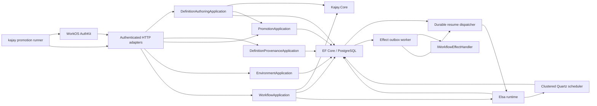

# Workflow host

- Area: Durable workflow execution and definition promotion
- Status: active foundation
- Owner: Jarod
- Last updated: 2026-08-07

`Kajay.Workflow.Host` is the host-owned C# 14 modular monolith around `Kajay.Core`.
It persists immutable Definition Releases and Workflow Instances in PostgreSQL while
keeping survey execution and Response Snapshot semantics in the SDK.

## Run with Docker Compose

### Local WorkOS Emulate stack

The recommended local stack runs the workflow host, PostgreSQL, and a pinned WorkOS
Emulate container together:

```bash
docker compose \
  -f compose.yaml \
  -f compose.workos-emulate.yaml \
  --profile workflow up --build
```

Open <http://localhost:4175> for the dual-runtime demo and its **Managed** Creator tab.
Choose its local sign-in link, or open
<http://localhost:4175/auth/login?loginHint=admin%40kajay.local>, to walk the
interactive AuthKit login. The callback stores a data-protected HTTP-only session and
returns to the demo. The authenticated same-origin proxy then supplies the session to
the workflow host. Logout is `POST /auth/logout`.

| Local identity | Role purpose |
| --- | --- |
| `admin@kajay.local` | Every Kajay permission |
| `author@kajay.local` | Definition manage and promote, without approval |
| `operator@kajay.local` | Workflow read and execute |
| `approver@kajay.local` | Definition promote and production approve |
| `environment-manager@kajay.local` | Environment catalog and binding administration |
| `client_kajay_local_promotion` | M2M definition export/install without production approval |
| `client_kajay_local_activation` | M2M production Activation after an external approval gate |
| `client_kajay_local_environment` | M2M Environment and binding administration |

Interactive Emulate selects by email; every seeded password is `kajay-local` for
direct password-grant experiments. The emulator is exposed only on
`127.0.0.1:4100`. Plain HTTP, `sk_test_default`, and its in-memory data are local-test
facilities, never deployment defaults.

The local M2M secrets are `secret_kajay_local_promotion`,
`secret_kajay_local_activation`, and `secret_kajay_local_environment`. They are
deterministic test fixtures, not examples of acceptable deployed secrets.

### Real WorkOS environment

Set the public WorkOS Client ID for the AuthKit environment whose access tokens the
host accepts. The default issuer and API base are the WorkOS production endpoints;
set the latter two variables when the WorkOS environment uses different endpoints.

```bash
export WORKOS_CLIENT_ID=client_...
# Optional when AuthKit is configured with an API Resource Indicator:
export WORKOS_AUDIENCE=https://workflow.example.com
export WORKOS_ISSUER=https://api.workos.com/
export WORKOS_API_BASE_URL=https://api.workos.com
```

The host remains a bearer-only resource server by default. To let it own browser login,
set `WORKOS_SESSION_ENABLED=true`, `WORKOS_API_KEY`, `WORKOS_BROWSER_BASE_URL`,
`WORKOS_CALLBACK_URL`, `WORKOS_POST_LOGIN_REDIRECT_URL`, and
`WORKOS_POST_LOGOUT_REDIRECT_URL`. The included cookie adapter is local/demo
infrastructure. Treating the host as a production BFF needs a separate design for
distributed refresh coordination, cookie size and revocation, CSRF protection, HTTPS,
and durable Data Protection key storage.

```bash
docker compose --profile workflow up --build
```

The API is published at <http://localhost:5082>, PostgreSQL remains internal to the
Compose network, and a named volume retains state. The application applies committed
EF Core migrations before its API and workers start. Remove the volume only when a
full local reset is intended:

```bash
docker compose --profile workflow down --volumes
```

## Module shape



`Definitions`, `Workflows`, `Delivery`, `Persistence`, and `Api` are capability
folders inside one deployable application. They are not separately published
packages. Controllers do not reproduce release validation, snapshot restoration,
concurrency, idempotency, audit, timer, or outbox choreography. Definition Releases
remain authoritative; a host-only compiler translates their portable graph to Elsa
activities without adding Elsa types to SDKs, bundles, or HTTP contracts.

## Workflow Definition format v1

The first host format is deliberately linear and acyclic. It supports `survey`,
`delay`, `effect`, and `end` steps:

```json
{
  "formatVersion": 1,
  "initialStep": "profile",
  "steps": [
    {
      "key": "profile",
      "kind": "survey",
      "surveyDefinitionDigest": "sha256:<64 lowercase hex characters>",
      "next": "wait"
    },
    {
      "key": "wait",
      "kind": "delay",
      "delaySeconds": 60,
      "next": "notify"
    },
    {
      "key": "notify",
      "kind": "effect",
      "effectType": "example.notification",
      "payload": { "template": "welcome" },
      "next": "end"
    },
    { "key": "end", "kind": "end" }
  ]
}
```

Every referenced survey must be present in the release bundle under its Definition
Digest. Instances remain pinned to the release selected when they started; later
Activation changes affect only new instances.

## HTTP interface

Every application request carries a WorkOS access token as `Authorization: Bearer
<token>`. The host validates its JWKS signature, RS256 algorithm, issuer, audience,
expiry, `sub`, and `org_id`. The organization claim is the tenant boundary and the
subject claim is the audit actor; caller-selected identity headers are ignored.
Human AuthKit sessions carry Kajay capabilities in `permissions`; WorkOS M2M tokens
carry them as a space-delimited `scope`. Both claims satisfy the same host policies
only after normal token validation succeeds.
Workflow commands additionally require `Idempotency-Key`; updates require a numeric
`If-Match` ETag.

| Operation | Required WorkOS permission | Route |
| --- | --- | --- |
| Read a managed draft | `kajay:definition:manage` | `GET /api/management/definitions/{name}/draft` |
| Inspect release history and provenance | `kajay:definition:manage` | `GET /api/management/definitions/{name}/provenance?environmentName=...` |
| Page/filter revision history | `kajay:definition:manage` | `GET /api/management/definitions/{name}/provenance/revisions?limit=...&cursor=...&query=...` |
| Page/filter release history | `kajay:definition:manage` | `GET /api/management/definitions/{name}/provenance/releases?environmentName=...&limit=...&cursor=...&query=...&status=...` |
| Compare a release to the active or explicit baseline | `kajay:definition:manage` | `GET /api/management/definitions/{name}/provenance/releases/{digest}/comparison?environmentName=...&baselineDigest=...` |
| Page/filter audit history | `kajay:definition:manage` | `GET /api/management/definitions/{name}/provenance/audit?environmentName=...&limit=...&cursor=...&query=...` |
| Create or save a managed draft | `kajay:definition:manage` | `PUT /api/management/definitions/{name}/draft` |
| Checkpoint an immutable revision | `kajay:definition:manage` | `POST /api/management/definitions/{name}/revisions` |
| Assemble a release from a revision | `kajay:definition:promote` | `POST /api/management/definitions/{name}/revisions/{number}/releases` |
| Preflight a target | `kajay:definition:manage` | `POST /api/management/releases/preflight?environmentName=...` |
| Preflight an installed release | `kajay:definition:manage` | `POST /api/management/releases/{digest}/preflight?environmentName=...` |
| Install a `.kajay` bundle | `kajay:definition:promote` | `POST /api/management/releases/install` |
| Export an installed bundle | `kajay:definition:manage` | `GET /api/management/releases/{digest}/bundle` |
| List Environments | `kajay:definition:manage` | `GET /api/management/environments` |
| Create an Environment | `kajay:environment:manage` | `POST /api/management/environments` |
| Update Environment policy | `kajay:environment:manage` | `PUT /api/management/environments/{environment}` |
| List binding metadata | `kajay:definition:manage` | `GET /api/management/environments/{environment}/bindings` |
| Set a binding reference | `kajay:environment:manage` | `PUT /api/management/environments/{environment}/bindings/{name}` |
| Remove a binding | `kajay:environment:manage` | `DELETE /api/management/environments/{environment}/bindings/{name}` |
| Activate or roll back | `kajay:definition:promote` | `PUT /api/management/environments/{environment}/activations/{name}` |
| Start an instance | `kajay:workflow:execute` | `POST /api/environments/{environment}/definitions/{name}/instances` |
| Read/resume an instance | `kajay:workflow:read` | `GET /api/instances/{id}` |
| Save a Response Snapshot | `kajay:workflow:execute` | `PUT /api/instances/{id}/response` |
| Complete the active survey step | `kajay:workflow:execute` | `POST /api/instances/{id}/complete` |
| Read immutable Survey Submissions | `kajay:workflow:read` | `GET /api/instances/{id}/submissions` |
| Inspect audit facts | `kajay:workflow:read` | `GET /api/instances/{id}/audit` |
| Inspect timers, effect delivery, and resume dispatch | `kajay:workflow:read` | `GET /api/instances/{id}/work` |

Bundle request bodies use `application/vnd.kajay.bundle+zip`. Activation of any
Environment whose policy requires approval also requires
`kajay:definition:approve`. Its `approvedBy` value is the authenticated WorkOS subject
and cannot be supplied in the request body. Health is anonymous; OpenAPI requires
`kajay:definition:manage`.

Create these permission slugs in WorkOS and assign them through roles. Keep
`kajay:definition:approve` out of routine definition-manager roles; a production
approver role should receive both promote and approve permissions. The host checks
permissions rather than role names so role composition can evolve without code changes.
Keep `kajay:environment:manage` separate from routine authoring, promotion, and
approval roles because it changes the policy and configuration those operations trust.

## Promote with the Kajay CLI

`Kajay.Cli` is a packable .NET tool and remains outside `Kajay.Core`. It reads secrets
only from environment variables, obtains short-lived tokens using the OAuth 2.0
client-credentials grant, and prints a JSON result suitable for CI.

```bash
export KAJAY_SOURCE_CLIENT_SECRET=source-secret-from-ci
export KAJAY_TARGET_CLIENT_SECRET=target-secret-from-ci

kajay promote \
  --source-host https://workflow.dev.example.com \
  --source-token-endpoint https://dev-example.authkit.app/oauth2/token \
  --source-client-id client_source_promotion \
  --target-host https://workflow.staging.example.com \
  --target-token-endpoint https://staging-example.authkit.app/oauth2/token \
  --target-client-id client_target_promotion \
  --release sha256:<64-lowercase-hex-characters> \
  --environment staging \
  --activate \
  --expected-version 0
```

Without `--activate`, the command stops after compatible, idempotent installation.
With it, `--expected-version` is mandatory. Preflight reports the target Environment's
approval policy; when approval is required, the CLI reacquires its target token with
`kajay:definition:approve`. Use a distinct target client credential made available
only to the post-approval deployment job. Re-running that job safely repeats export,
preflight, and idempotent install before the concurrency-checked Activation.

For local development, run the tool from source and point both token endpoints to
`http://localhost:4100/oauth2/token`. The seeded routine promotion credential lacks
approval, while `client_kajay_local_activation` demonstrates the separately protected
production credential.

## Transaction and recovery rules

- Draft saves and revision checkpoints take a per-tenant/per-definition PostgreSQL
  advisory lock. Draft versions are ETags; a stale editor receives `412` without
  changing stored JSON.
- A Draft stores SDK-canonical JSON and its Definition Digest. One immutable Revision
  exists per Draft version, so retrying a checkpoint returns the same revision.
- Release assembly reads only a Revision. The initial assembler produces a
  single-survey `survey → end` workflow and hands the deterministic bundle to the same
  installer used for imported promotion artifacts.
- Authored release provenance is an idempotent many-to-many relation between immutable
  Revisions and release digests. Imported releases can have no local Revision.
- Active, ready, and blocked release states are derived from the selected Activation
  and current Environment Bindings. Rollback reuses the optimistic, audited Activation
  command and is offered only for a previously active, currently compatible release.
- Provenance histories return opaque, versioned keyset cursors in collection-specific
  page envelopes. The initial composite query reads only the first page; independent
  routes page and filter revisions, releases, or audit without unbounded materialization.
- Release comparison normalizes stored artifacts by embedding Definition content into
  workflow survey steps, sorting bindings, and aligning named arrays before diffing.
  It returns at most 200 compact changes grouped by definition, workflow, bindings,
  and compatibility; it never mutates or authorizes an Activation.
- Environments are explicit tenant resources. Display name, ordering, approval policy,
  and binding metadata use ETags and management audit facts. Binding references are
  accepted only on writes and never returned or included in audit payloads.
- Each Workflow Command takes a transaction-scoped PostgreSQL advisory lock for its
  tenant/idempotency key. Concurrent retries therefore return one stored result.
- Compiled Elsa definition registration takes a digest-scoped PostgreSQL advisory
  lock so concurrent starts on different replicas cannot race Elsa's unique index.
- Workflow Instance `Version` is an EF concurrency token and is returned as an ETag.
  A stale command fails with `412 Precondition Failed`.
- Instance state, mutable Response Snapshot, immutable Survey Submission, audit fact,
  idempotency result, and any new resume or effect-outbox record commit in one database
  transaction.
- Instance creation, Survey acceptance, and effect delivery enqueue stable, leased
  Workflow Resume records.
  Synchronous dispatch keeps the common path responsive; background retry closes the
  crash window between Kajay's transaction and Elsa's persistence transaction.
- Workers claim short batches with `FOR UPDATE SKIP LOCKED` and expiring leases.
- Effects are at-least-once. `WorkflowEffect.Id` is stable so real downstream adapters
  can deduplicate retries.
- Failed work retries with capped exponential backoff and becomes `dead-letter` after
  the configured maximum. Operational state remains queryable through the work route.
- Elsa owns delay suspension and advancement. Clustered Quartz stores absolute UTC
  deadlines in PostgreSQL and transfers due work between replicas during a rolling
  restart. `scheduled_actions` is an operational projection, not a second scheduler.

## `.kajay` bundle format v1

A bundle is a bounded ZIP archive with no environment substitutions:

```text
manifest.json
workflow.json
surveys/<definition-sha256>.json
```

The manifest names the Managed Definition, immutable version label, conformance
version, required Environment Bindings, and every survey path/digest. Import rejects
unsafe paths, duplicate or unexpected entries, oversized archives, definition errors,
digest mismatches, missing dependency closure, unsupported conformance versions, and
version-label reuse. Export returns the installed bytes. Target preflight reports
missing binding names before idempotent install and atomic Activation.

## Verification

`Kajay.Workflow.Host.Tests` uses Testcontainers with PostgreSQL 18. Its HTTP tracers
prove promotion and rollback concurrency, save/resume behavior, immutable submission
history, stale-write rejection, concurrent idempotency and Elsa registration, atomic
effect creation, Quartz failover, outbox delivery, and dead-letter behavior through the
same routes used by consumers. Authentication proofs
use signed RS256 bearer tokens and the real JWT middleware to cover missing identity,
permission denial, organization isolation, and authenticated production approval.
The WorkOS Emulate proof additionally runs the pinned emulator on a random port and
walks interactive PKCE login, code exchange through `WorkOS.net`, cookie-backed bearer
validation, logout, the exact author/operator/approver permission sets, and real M2M
client-credentials tokens. Machine promotion proves routine scoped access, denied
production approval, and success through the distinct approval principal.
The authoring tracer proves author save and checkpoint, release assembly, authenticated
production approval, and operator completion in one PostgreSQL-backed flow. A real
Chromium feature proof covers the Creator's draft/revision/release states and login
recovery through its public feature interface. The provenance tracer additionally
proves tenant isolation, lineage, readiness derivation, audit attribution,
version-checked rollback, cursor continuity, filter behavior, and invalid cursor
rejection; real Chromium proves the Managed UI confirmation, load-more, and filter-reset
flows. The release-comparison tracer additionally proves active and explicit baseline
selection, semantic named-array paths, binding changes, initial-release handling, and
the absence of digest-only noise; Chromium proves the review and local-error flows.

```bash
dotnet test dotnet/tests/Kajay.Workflow.Host.Tests
```

## Parent and related links

- [Project context](../CONTEXT.md)
- [Workflow host ownership decision](./adr/0035-workflow-host-owns-durable-orchestration.md)
- [Definition promotion decision](./adr/0036-definition-release-promotion.md)
- [WorkOS identity decision](./adr/0037-workos-authenticated-workflow-host.md)
- [WorkOS Emulate decision](./adr/0038-workos-emulate-local-authentication.md)
- [Managed authoring decision](./adr/0039-managed-definition-authoring-lifecycle.md)
- [Promotion CLI and machine identity decision](./adr/0040-promotion-cli-and-workos-machine-identity.md)
- [Managed release history and provenance decision](./adr/0041-managed-release-history-and-provenance.md)
- [Portable Response Snapshot decision](./adr/0034-portable-response-snapshot-contract.md)
- [Elsa execution-engine decision](./adr/0043-elsa-host-workflow-engine.md)
